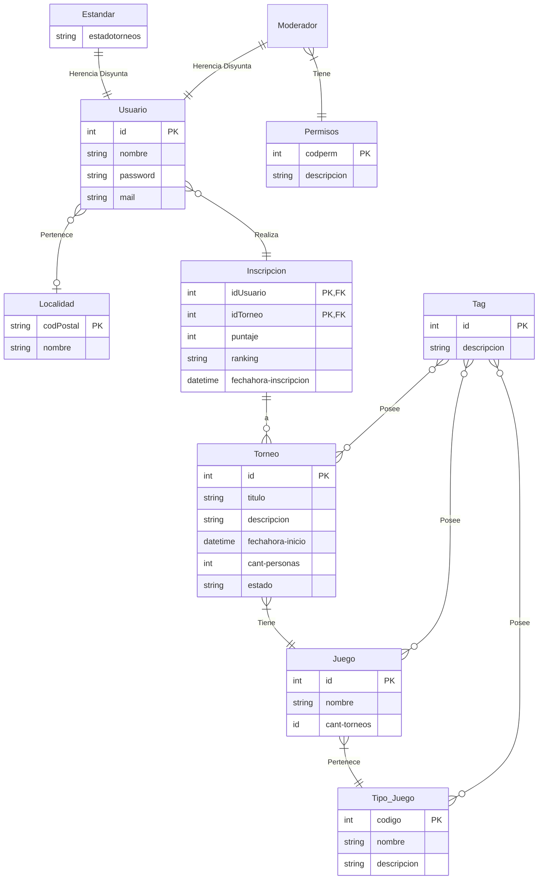

# Gestion-Torneos-dsw
## Grupo
### Integrantes
51657 - Quagliardi, Martín Nicolás.

50937 - Urquiza, Nicolás.

51079 - Regodesebes, Mateo Ariel 

### Repositorio
[*Repositorio con backend y frontend*](https://github.com/MarthQ/gestion-torneos-dsw)

## Tema
### Descripción
La propuesta consiste en desarrollar una aplicación web que habilite a los usuarios crear y organizar torneos relacionados a videojuegos competitivos, permitiendo la inscripción de los participantes a los eventos y la creación automática de las llaves correspondientes justo antes de la realización del torneo. También permitirá mostrar una imagen generada automáticamente que presente los puestos finales del torneo.
	
Inicialmente, los torneos se limitan a juegos con un único ganador por partida, por lo tanto, no se admitirá la participación de grupos. En su lugar, los jugadores se inscribirán de manera individual.

## Modelo
Modelo de Dominio y DER: https://drive.google.com/file/d/1vmKh96SPnYbbzmiK3RvOFFA7i3dR8jJX/view?usp=sharing

### Visualización del DER en Mermaid

## Alcance funcional

### Alcance minimo

*Regularidad:*
|Req|Detalle|
|:-|:-|
|CRUD simple|1. CRUD Usuario 2. CRUD Tipo de Torneo 3. CRUD Tipo de Juego|
|CRUD dependiente|1. CRUD de Torneos {depende de} CRUD Tipo de Torneo 2. CRUD Videojuegos {depende de} CRUD Tipo de Juego|
|Listado + detalle| 1. Podio de cada Torneo filtrado por Puntaje/Condición de Victoria => Detalle: Localidad 2.  Listado de Torneos filtrado por juego => Detalle: Fecha|
|CUU/Epic|1. Generar llave de torneo 2. Inscribir usuario a torneo|

*Adicionales para Aprobación:*
|Req|Detalle|
|:-|:-|
|CRUD |1.  CRUD Usuarios 2.  CRUD Tipo de Torneo 3.  CRUD Tipo de Juego 4.  CRUD de Torneos 5.  CRUD Videojuegos 6.  CRUD Localidades 7.  CRUD Moderador|
|CUU/Epic|1. Generar llave de torneo. 2. Inscribir usuario a torneo. 3. Generar promedio de torneos ganados por juego.|

### Alcance Adicional Voluntario
|Req|Detalle|
|:-|:-|
|Listados |- Listado de Usuarios filtrado por Localidad (Ordenado por Puntaje/Condición de Victoria) - Listado de Partidas filtrado por Jugador(Ordenado por fecha)|
|CUU/Epic|- Gestionar Perfil de Usuario  - Recuperar Contraseña - Enviar Resultados de un Torneo - Notificar Torneos próximos|
|Otros|- Generar automáticamente imagen personalizada para los puestos de cada torneo (por juego)|
