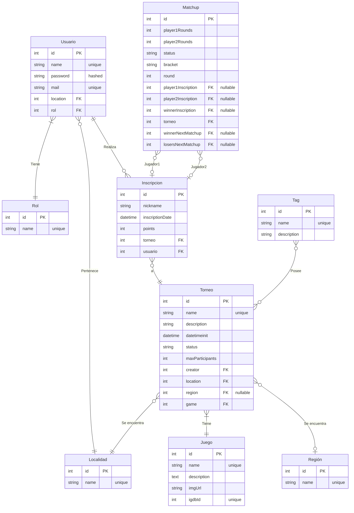

# Gestion-Torneos-dsw

## Grupo

### Integrantes

51657 - Quagliardi, Martín Nicolás.

50937 - Urquiza, Nicolás.

51079 - Regodesebes, Mateo Ariel

48128 - Socolsky, José

### Repositorio

[_Repositorio con backend y frontend_](https://github.com/MarthQ/gestion-torneos-dsw)

## Tema

### Descripción

La propuesta consiste en desarrollar una aplicación web que habilite a los usuarios crear y organizar torneos relacionados a videojuegos competitivos, permitiendo la inscripción de los participantes a los eventos y la creación automática de las llaves correspondientes justo antes de la realización del torneo. También permitirá mostrar una imagen generada automáticamente que presente los puestos finales del torneo.
Inicialmente, los torneos se limitan a juegos con un único ganador por partida, por lo tanto, no se admitirá la participación de grupos. En su lugar, los jugadores se inscribirán de manera individual.

## Modelo

Modelo de Dominio y DER: https://drive.google.com/file/d/1vmKh96SPnYbbzmiK3RvOFFA7i3dR8jJX/view?usp=sharing

### Visualización del DER en Mermaid

```mermaid
erDiagram

Usuario {
int id PK
string name "unique"
string password "hashed"
string mail "unique"
int location FK
int rol FK
}

Localidad {
int id PK
string name "unique"
}

Región {
int id PK
string name "unique"
}

Rol {
int id PK
string name "unique"
}

Juego {
int id PK
string name "unique"
text description
string imgUrl
int igdbId "unique"
}

Torneo {
int id PK
string name "unique"
string description
datetime datetimeinit
string status
int maxParticipants
int creator FK
int location FK
int region FK "nullable"
int game FK
}

Tag {
int id PK
string name "unique"
string description
}

Inscripcion {
int id PK
string nickname
datetime inscriptionDate
int points
int torneo FK
int usuario FK
}

Matchup {
int id PK
int player1Rounds
int player2Rounds
string status
string bracket
int round
int player1Inscription FK "nullable"
int player2Inscription FK "nullable"
int winnerInscription FK "nullable"
int torneo FK
int winnerNextMatchup FK "nullable"
int losersNextMatchup FK "nullable"
}

    Usuario }|--|| Rol: Tiene
    Usuario }o--|| Localidad: Pertenece
    Usuario ||--o{ Inscripcion: Realiza

    Inscripcion }o--|| Torneo: a

    Torneo }|--|| Juego: Tiene
    Torneo }o--|| Localidad: "Se encuentra"
    Torneo }o--o| Región: "Se encuentra"

    Tag }o--o{ Torneo: Posee

    Matchup }o--o| Inscripcion: Jugador1
    Matchup }o--o| Inscripcion: Jugador2
```

## Alcance funcional

### Alcance minimo

_Regularidad:_
|Req|Detalle|
|:-|:-|
|CRUD simple|1. CRUD Localidad 2. CRUD Roles 3. CRUD Juego|
|CRUD dependiente|1. CRUD de Usuario {depende de} CRUD Localidades 2. CRUD Torneos {depende de} CRUD Juego|
|Listado + detalle| 1. Podio de cada Torneo filtrado por Puntaje/Condición de Victoria => Detalle: Localidad 2. Listado de Torneos filtrado por juego => Detalle: Fecha|
|CUU/Epic|1. Creacion de Torneo 2. Inscribir usuario a torneo|

_Adicionales para Aprobación:_
|Req|Detalle|
|:-|:-|
|CRUD |1. CRUD Usuarios 2. CRUD Juegos 3. CRUD Localidades 4. CRUD Torneos 5. CRUD Regiones 6. CRUD Tag  7. CRUD Roles|
|CUU/Epic|1. Creacion de Torneo 2. Inscribir usuario a torneo. 3. Generar llave de torneo.|

### Alcance Adicional Voluntario

| Req      | Detalle                                                                                                                                       |
| :------- | :-------------------------------------------------------------------------------------------------------------------------------------------- |
| Listados | - Listado de Usuarios filtrado por Localidad (Ordenado por Torneos ganados) - Listado de Partidas filtrado por Jugador(Ordenado por fecha) |
| CUU/Epic | - Gestionar Perfil de Usuario  - Recuperar Contraseña - Enviar Resultados de un Torneo - Notificar Torneos próximos                  |
| Otros    | - Generar automáticamente imagen personalizada para los puestos de cada torneo (por juego)                                                    |
