# Documentación

### Proposal actualizada

La proposal actualizada puede encontrarse en el siguiente archivo [README](../README.md) junto con la estructura de datos del proyecto

### Instrucciones de instalación

Las instrucciones de instalación pueden encontrarse en los respectivos directorios tanto de [Backend](../backend/README.md#instalación) como de [Frontend](../frontend/README.md#instalación)

### Links a los PR/MR

Los PR/MR pueden encontrarse en el proyecto de GitHub Projects:

- [Gestion de Torneos](https://github.com/users/MarthQ/projects/1)

### Minutas de reunión y avance

Las minutas de reunión y avance se realizaron y planificaron en la puesta en marcha del proyecto. Muchas de estas fueron documentadas a través de TODOs' lists que se perdieron entre mensajes.
La mayor documentación de avances se encuentra en

- [Lista de PR/MR](https://github.com/users/MarthQ/projects/1).
- En algunos TODO informales como los siguientes:
    > Lease:  
    > Frontend developer: Jose Socolsky  
    > Alfajor fulbito: Nicolas Urquiza  
    > Galletitas Mana: Martin Quagliardi  
    > Bizcocho Negrito Don Shionur: Mateo Regodesebes  

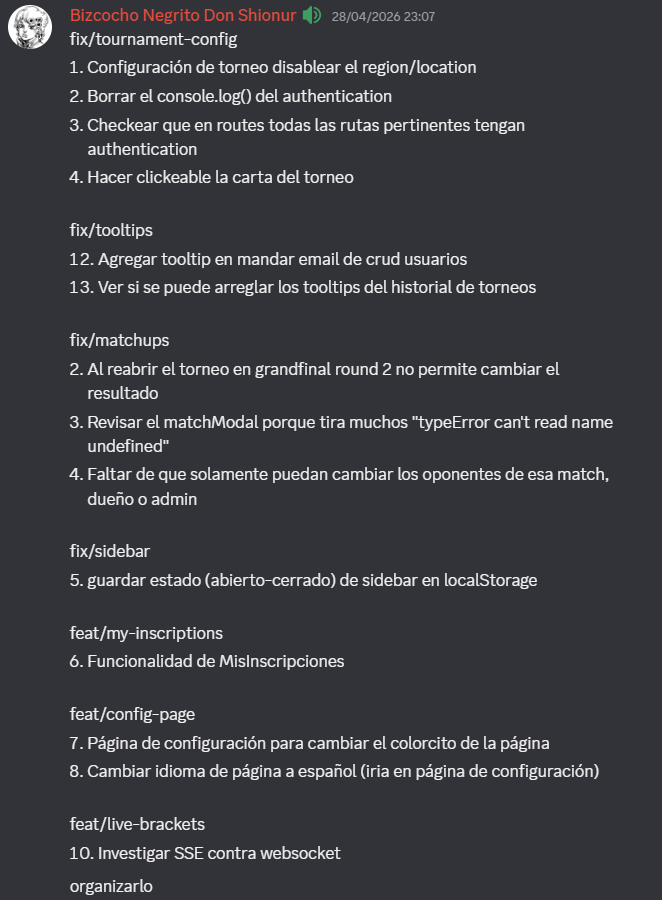  

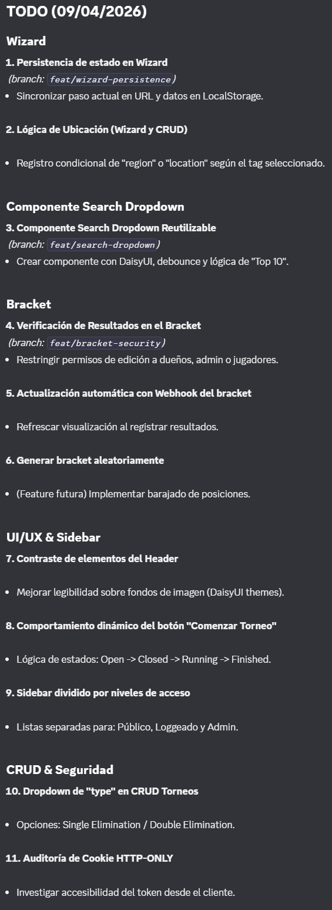  

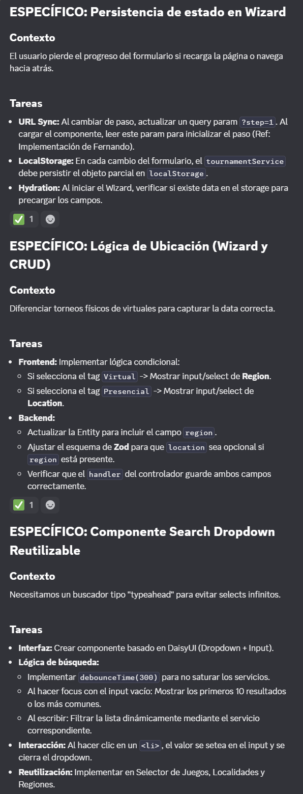  

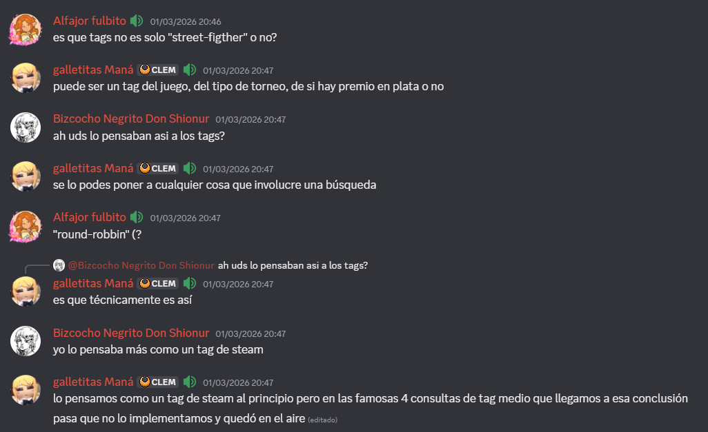  

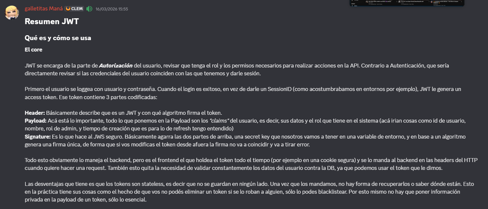  

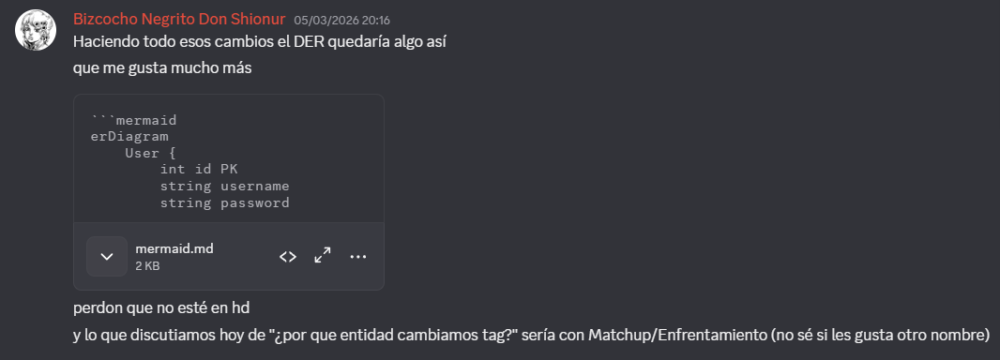  

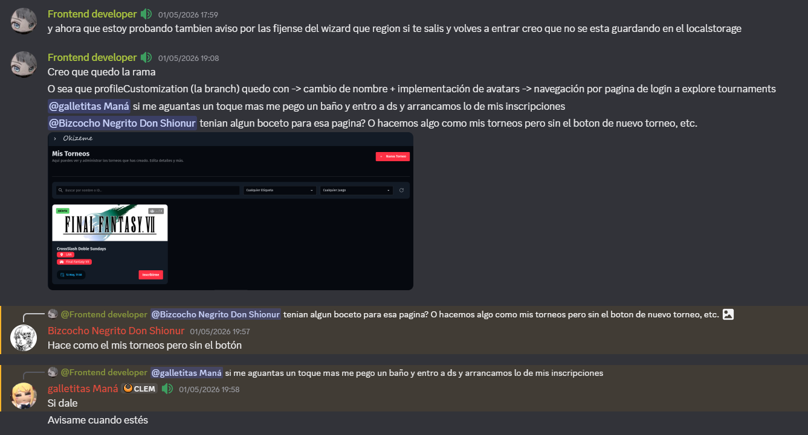  

### Tracking de features, bug e issues

El tracking de features fue llevado a cabo a través de las [ramas](https://github.com/MarthQ/gestion-torneos-dsw/branches) del repositorio usando nombres claves para separar intrinsecamente features, developer branches y fixes.
Además se creó en el chat utilizado para el proyecto un canal dedicado al tracking de Bugs y mejoras.

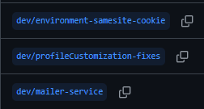 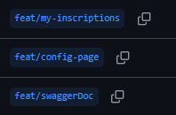 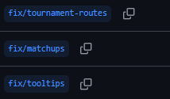

 

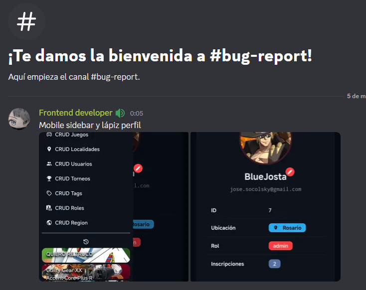  

 

### Documentacion de la API

La documentación de la bracket puede encontrarse en la ruta /api-docs de la API de backend.
La misma se realizó a través de [Swagger](https://swagger.io/)

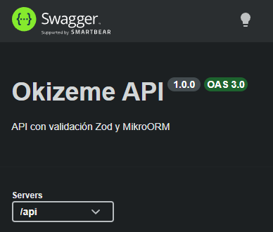

 

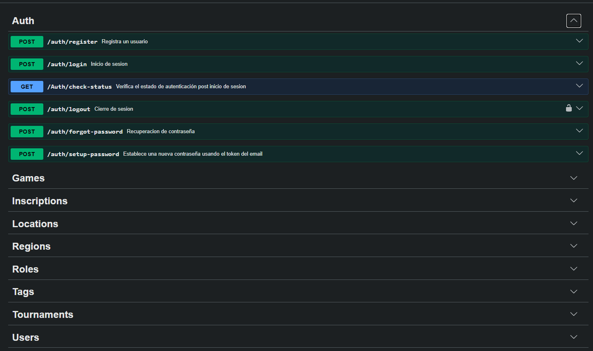

### Evidencia de ejecución de test automáticos

Los tests tanto de Backend como de Frontend y sus respectivos comandos de ejecución pueden encontrarse en los README especificos de sus capas funcionales.

#### Backend

- Tests unitarios:  
  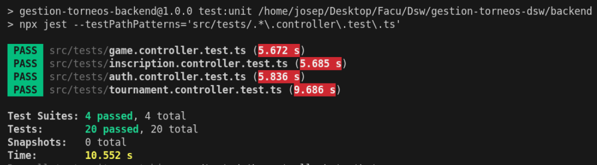

- Test de integración  
  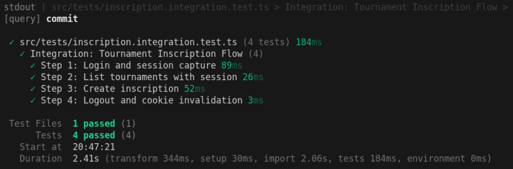

#### Frontend

- Tests de componentes unitarios

    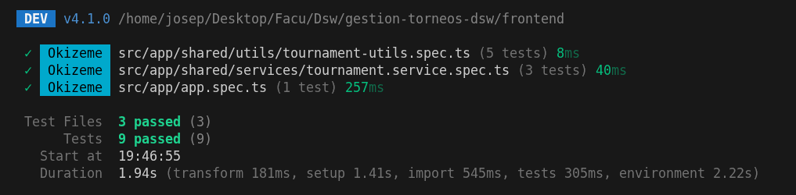

- Test End to End - E2E Login con cypress

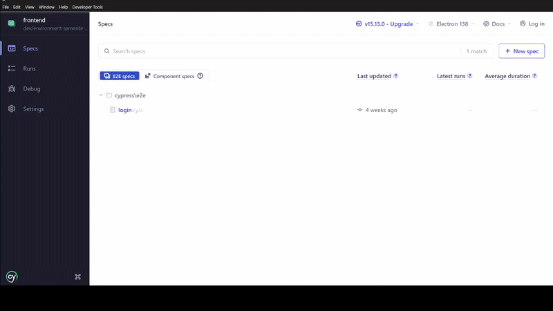  
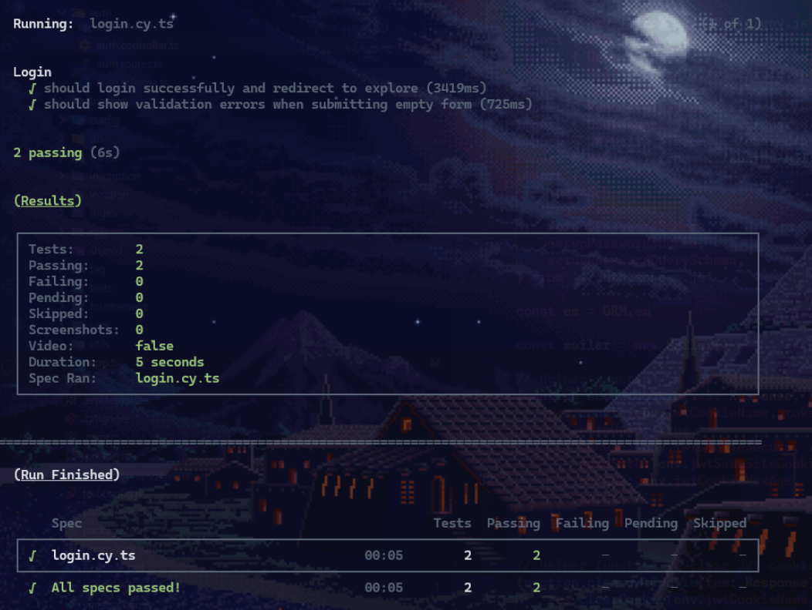

 

### Demo de app en video

La demo en video de la aplicación se encuentra publicada en la plataforma [YouTube](https://youtu.be/V9LZAGmlxrw)

### Deploy

El proyecto se encuentra desplegado y en funcionamiento en un servidor que nos proporcionó un compañero [Matías Catalá](https://github.com/maticatala), a quien agradecemos por su apoyo:

- [Frontend](https://okizeme.matiascatala.com/)
- [Backend](https://api.matiascatala.com/)

En caso de requerir un deploy alternativo, se dispone de otro deploy en [Railway](https://railway.com/), el cual no se utilizó para esta entrega debido a su límite de requests gratuitas, teniendo un máximo de 5 USD mensuales en formato de requests.
